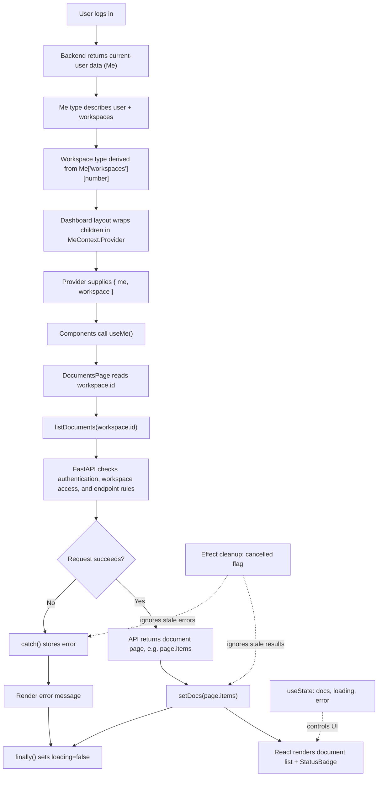

# Lumen — Current Flow (Till Now)

This diagram documents the flow we have discussed so far: user data, workspace context, the Documents page, API fetching, and backend authorization.

## Key files and responsibilities

| File / symbol | Responsibility |
|---|---|
| `@/lib/api` — `Me` | TypeScript shape of the current-user API data |
| `@/lib/me-context.tsx` | Defines `Workspace`, `Ctx`, `MeContext`, and `useMe()` |
| Dashboard layout / Provider owner | Supplies the actual `{ me, workspace }` context value |
| `DocumentsPage` | Reads the workspace, fetches documents, and renders loading/error/empty/list states |
| `listDocuments()` | Performs the frontend API request; check its implementation for the exact URL and response type |
| FastAPI endpoints / permission helpers | Enforce access on the server; frontend context is not a security boundary |
| `StatusBadge` | Displays each document's status |

## Important implementation notes

- `createContext<Ctx | null>(null)` creates the context; it does **not** fetch the user or populate the workspace.
- `MeContext.Provider` must supply a non-null value for `useMe()` to work.
- `Workspace = Me["workspaces"][number]` derives the workspace item type from the `Me` API type.
- `useEffect(..., [workspace.id])` reloads documents when the selected workspace ID changes.
- The `cancelled` flag prevents stale Promise callbacks from updating state; it does not cancel the network request itself.
- The backend must independently verify authentication and workspace/document permissions.
- If the API response is not shaped like `{ items: [...] }`, update the `page.items` handling to match the actual response schema.

## Where to make future changes

- **Add a shared context value:** update `Ctx` and the value passed by `MeContext.Provider`.
- **Change user/workspace API fields:** update `Me` in `@/lib/api` and confirm the backend response matches.
- **Change workspace selection:** inspect the Provider owner, dashboard layout, and workspace selector.
- **Change document fetching:** inspect `listDocuments()` and its response type in `@/lib/api`.
- **Change permissions:** enforce them in FastAPI; update the UI separately if it needs to reflect permissions.
- **Change document display:** update `DocumentsPage` and/or `StatusBadge`.

## Suggested location in the repository

Save this file as `docs/lumen-current-flow.md`. GitHub renders Mermaid diagrams in Markdown, so the diagram can live alongside the project documentation.
